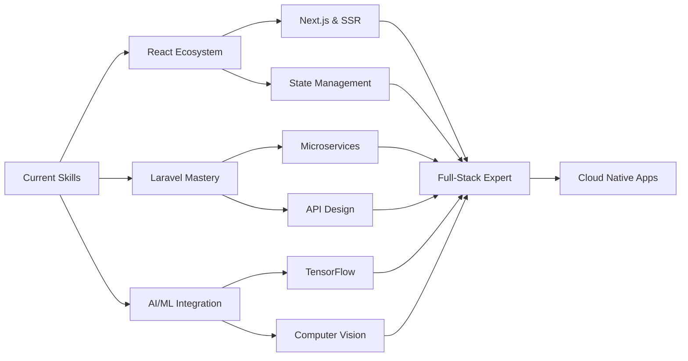

<div align="center">


[](https://github.com/Prasantha123123)
[](https://github.com/Prasantha123123)
[](https://www.linkedin.com/in/prasantha-raman-8788aa262)

</div>


## 🎭 About Me | The Developer Behind The Code


```typescript
interface Developer {
  name: string;
  title: string;
  location: string;
  education: string;
  passions: string[];
  techStack: {
    frontend: string[];
    backend: string[];
    ai: string[];
  };
}

const prasantha: Developer = {
  name: "R Prasantha",
  title: "Full-Stack Software Developer",
  location: "Sri Lanka 🇱🇰",
  education: "Software Engineering Student (Year 3)",
  passions: [
    "Crafting elegant solutions",
    "AI/ML innovation",
    "Clean architecture",
    "Open source contribution"
  ],
  techStack: {
    frontend: ["React.js", "Next.js", "Tailwind CSS"],
    backend: ["Laravel", "Node.js", "RESTful APIs"],
    ai: ["Python", "TensorFlow", "NLP"]
  }
};

console.log("Code with purpose 🚀");
```

<br clear="right"/>

### 🌟 Quick Facts

- 🔭 Currently building **scalable web applications** with modern tech stack
- 🌱 Learning **Next.js, Microservices, and Cloud Architecture**
- 💡 Passionate about **AI/ML integration** in web applications
- 🎯 Open for **freelance projects** and **collaborations**
- ⚡ Fun fact: I turn coffee into code ☕ → 💻


## 🛠️ Tech Arsenal | Weapons of Choice

<div align="center">

### Frontend Mastery


### Backend Excellence


### Database & Cloud


### Programming Languages


### Tools & Platform


</div>


## 🚀 Featured Projects | Portfolio Highlights

<div align="center">

<table>
<tr>
<td width="50%">

### 🤖 AI Resume Analyzer
<a href="https://aipoweredresumeanalyzer.netlify.app/" target="_blank">

</a>

**Intelligent resume analysis using AI/ML**
- 🧠 Machine Learning powered insights
- 📊 Resume scoring & recommendations
- 🎯 Job matching algorithm

**Tech:** Python • Flask • React • NLP

</td>
<td width="50%">

### 💼 Personal Portfolio
<a href="https://prasantha.netlify.app/" target="_blank">

</a>

**Modern portfolio with animations**
- ✨ Smooth animations & transitions
- 📱 Fully responsive design
- 🎨 Interactive UI elements

**Tech:** React.js • CSS3 • JavaScript

</td>
</tr>

<tr>
<td width="50%">

### 🎓 Student Management
<a href="https://github.com/Prasantha123123/Student-Management-System" target="_blank">

</a>

**Comprehensive academic management**
- 📚 Student records management
- 📈 Grade tracking system
- 📊 Performance analytics

**Tech:** Java • MySQL • Swing

</td>
<td width="50%">

### 👆 Biometric Attendance
<a href="#" target="_blank">

</a>

**Secure fingerprint-based tracking**
- 🔐 Biometric authentication
- ⏱️ Real-time monitoring
- 📊 Automated reporting

**Tech:** Java • Biometric APIs • MySQL

</td>
</tr>
</table>

</div>


## 📊 GitHub Analytics | Development Insights

<div align="center">


</div>


## 🎯 Learning Roadmap | Continuous Evolution

<div align="center">



</div>

### 🎓 Currently Mastering

<table>
<tr>
<td width="33%" align="center">

**⚛️ Advanced React**
- Next.js Framework
- Server Components
- Performance Optimization
- Advanced Hooks

</td>
<td width="33%" align="center">

**🔧 Laravel Excellence**
- RESTful APIs
- Microservices
- Testing & TDD
- Security Best Practices

</td>
<td width="33%" align="center">

**🤖 AI/ML Integration**
- TensorFlow & PyTorch
- Natural Language Processing
- Computer Vision
- Model Deployment

</td>
</tr>
</table>


## 🏆 Achievements & Milestones

<div align="center">

| 🎯 Category | 🌟 Achievement |
|-------------|----------------|
| 🎓 **Academic** | Software Engineering Student • Strong Performance • Innovation Focus |
| 💻 **Technical** | Full-Stack Expert • React & Laravel Specialist • AI/ML Integration |
| 🤝 **Community** | Open Source Contributor • Knowledge Sharing • Tech Enthusiast |
| 🚀 **Projects** | 10+ Completed Projects • Production-Ready Apps • Clean Code Advocate |


</div>


## 💭 Philosophy & Vision

<div align="center">


### 🌟 What Drives Me

</div>

<table>
<tr>
<td width="25%" align="center">


**Purpose-Driven**

Building solutions that create real impact

</td>
<td width="25%" align="center">


**Innovation First**

Exploring cutting-edge technologies

</td>
<td width="25%" align="center">


**Collaborative**

Learning & growing with community

</td>
<td width="25%" align="center">


**Problem Solver**

Elegant solutions to complex challenges

</td>
</tr>
</table>


## 🤝 Let's Connect & Collaborate

<div align="center">


### 💬 Open for Exciting Opportunities

<a href="https://www.linkedin.com/in/prasantha-raman-8788aa262">

</a>
<a href="https://github.com/Prasantha123123">

</a>
<a href="https://prasantha.netlify.app">

</a>
<a href="mailto:prasantharaman2002@gmail.com">

</a>

### 🚀 Available For

</div>

<table align="center">
<tr>
<td align="center" width="20%">

💼

**Freelance Projects**

Full-stack development

</td>
<td align="center" width="20%">

🤝

**Open Source**

Meaningful contributions

</td>
<td align="center" width="20%">

💡

**Tech Discussions**

React, Laravel, AI/ML

</td>
<td align="center" width="20%">

🎯

**Internships**

Software roles

</td>
<td align="center" width="20%">

📚

**Mentorship**

Knowledge exchange

</td>
</tr>
</table>


<div align="center">

### ⭐ Show Some Love

**If you find my work valuable, consider starring my repositories!**


---


<br />

**Crafted with 💙 and lots of ☕ by R Prasantha**


</div>
